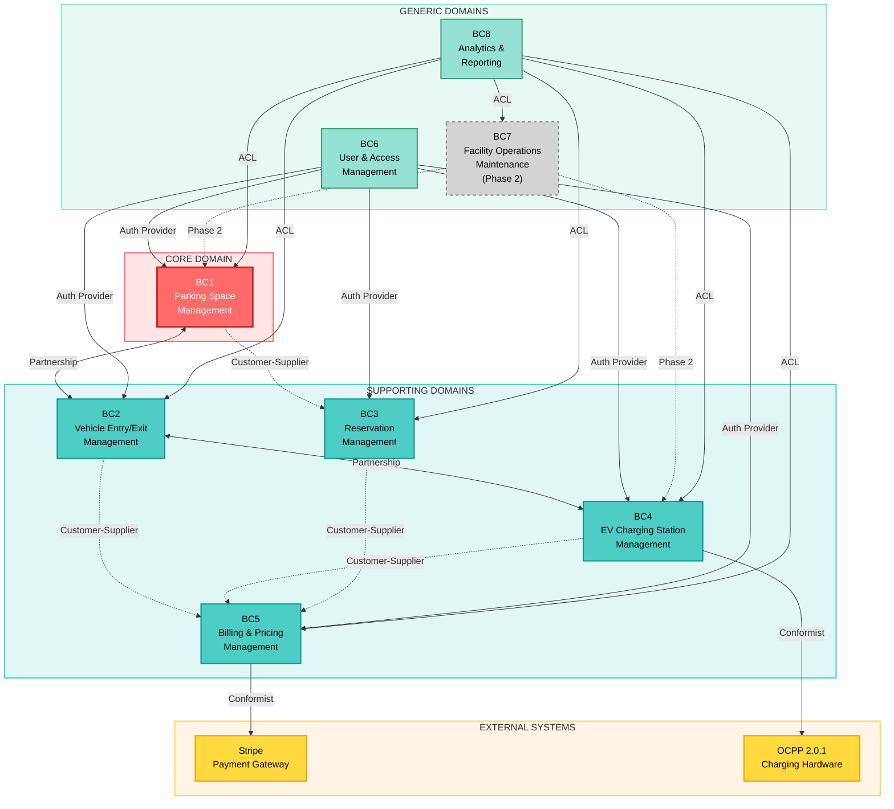

# EasyParkPlus: Bounded Context Diagram (MVP-Focused)

**Domain-Driven Design Lead:** Mihai  
**Date:** October 23, 2025 (Refined with Michael's Input)  
**Project:** EasyParkPlus Multi-Facility Parking & EV Charging Management System  
**MVP Launch:** March 2026 (Boston Downtown + Philadelphia Center City)

---

## Michael's MVP Decisions

**Launch Date**: March 2026 (5 months)  
**Facilities**: 2 (Boston Downtown, Philadelphia Center City)  
**Architecture**: Single-tenant, cloud-native  
**EV Charging**: OCPP 2.0.1, smart grid features (load balancing, peak shaving, demand response)  
**Pricing**: Static only (dynamic pricing Phase 2 after 3-6 months data)  
**Success Metrics**: 70% parking occupancy, 50% charger utilization

---

## Bounded Context Map (MVP Phasing)

This diagram shows the 8 bounded contexts with MVP phasing based on Michael's requirements.

**Legend:**
- **MVP Phase (March 2026)**: Core features for launch
- **Phase 2 (June-Sept 2026)**: Advanced features after 3-6 months data collection



---

## MVP vs Phase 2 Breakdown

### MVP Phase (March 2026) - 5 Months

**Core Bounded Contexts (Must-Have)**:
1. **BC1: Parking Space Management**
   - 2 facilities only (Boston Downtown, Philadelphia Center City)
   - Basic parking access control (entry, exit, slot availability)
   - IoT sensor integration for occupancy detection
   - Real-time space allocation

2. **BC2: Vehicle Entry/Exit Management**
   - Vehicle registration and identification
   - Parking session tracking
   - Entry/exit gate control
   - Session duration calculation

3. **BC3: Reservation Management**
   - Basic reservation creation and confirmation
   - Space allocation for reservations
   - Cancellation and refunds
   - Grace period handling (15 minutes)

4. **BC4: EV Charging Station Management**
   - 20-25 chargers per facility (40-50 total)
   - OCPP 2.0.1 protocol support (mandatory)
   - Charger activation and billing tracking
   - **Smart grid features** (per Michael):
     - Load balancing (max 400 kW per facility)
     - Peak shaving (reduce load during grid peaks)
     - Demand response (utility integration)
     - Energy metering (per-charger kWh tracking)

5. **BC5: Billing & Pricing Management**
   - **Parking billing**: Hourly rate + daily cap + monthly passes
   - **EV charging billing**: kWh + session fee + idle fee
   - Payment processing (app, card terminal, subscription auto-pay)
   - **NO dynamic pricing** (static rates only)

6. **BC6: User & Access Management**
   - User registration and authentication
   - Vehicle management (add/remove vehicles)
   - **Subscriptions with cross-facility benefits** (per Michael)
   - Role-based access control (basic)

7. **BC8: Analytics & Reporting**
   - **Occupancy metrics** (target: 70% average - Michael's success metric)
   - **Charger utilization metrics** (target: 50% during operating hours - Michael's success metric)
   - Basic dashboards for facility managers
   - Data collection for future ML models

**Minimal in MVP**:
8. **BC7: Facility Operations & Maintenance** (Phase 2 - basic monitoring only)
   - MVP: Manual incident reporting only
   - MVP: No automated maintenance scheduling
   - Vendor handles maintenance via SLA (per Michael)

---

### Phase 2 (June-Sept 2026) - After 3-6 Months Data

**Enhancements to Existing Contexts**:

1. **BC5: Billing & Pricing** - Dynamic Pricing
   - Activate dynamic pricing after 3-6 months of usage data (per Michael)
   - Occupancy-based rate adjustments (>85% = surge pricing)
   - Peak hour identification from historical data
   - ML-based demand forecasting

2. **BC7: Facility Operations & Maintenance** - Full Implementation
   - Automated maintenance scheduling
   - Predictive maintenance using health scores
   - Equipment failure prediction (7-day alerts)
   - Vendor SLA tracking and performance metrics

3. **BC8: Analytics & Reporting** - ML/AI Features
   - Revenue forecasting using ML models
   - Occupancy prediction for next 7 days
   - Customer behavior analysis
   - Anomaly detection for fraud/abuse

**New Features**:
- Expansion to New York facilities (3rd location per Michael)
- Advanced subscription tiers (fleet management)
- Integration with third-party valet services (per Michael)
- Mobile app enhancements (push notifications, in-app payments)

---

## Context Mapping Patterns Legend

### Pattern Types

| Pattern | Symbol | Meaning | Example in EasyParkPlus |
|---------|--------|---------|-------------------------|
| **Partnership** | ↔ (solid) | Mutual dependency, coordinated development | Parking Space ↔ Vehicle Entry/Exit |
| **Customer-Supplier** | → (dashed) | Upstream supplies downstream, defined interface | Vehicle Entry/Exit → Billing |
| **Conformist** | → (dashed + label) | Downstream conforms to upstream model | Billing → External Payment Gateway |
| **Anti-Corruption Layer (ACL)** | → (dashed + ACL) | Downstream protects itself with translation layer | Analytics reads all contexts via ACL |
| **Shared Kernel** | (Not shown) | Minimal shared code/data | Common: Money, DateTime, Location |

---

## Relationship Details

### 1. Partnership Relationships (Bidirectional Collaboration)

#### PSM ↔ VEM: Parking Space Management ↔ Vehicle Entry/Exit Management
- **Reason**: Real-time space allocation requires tight coordination
- **Communication**: 
  - VEM requests available space → PSM allocates space
  - PSM notifies VEM when space status changes
- **Events**:
  - `VehicleCheckedIn` → PSM marks space occupied
  - `SpaceAllocated` → VEM associates space with session

#### VEM ↔ EVC: Vehicle Entry/Exit Management ↔ EV Charging Station Management
- **Reason**: EV parking sessions linked to charging sessions
- **Communication**:
  - VEM notifies EVC when EV checks in → EVC initiates charging
  - EVC notifies VEM when charging completes → VEM allows checkout
- **Events**:
  - `VehicleCheckedIn` (EV) → `ChargingStarted`
  - `ChargingCompleted` → `VehicleCheckedOut` allowed

---

### 2. Customer-Supplier Relationships (Unidirectional Dependency)

#### PSM → RSV: Parking Space Management supplies Reservation Management
- **Reason**: Reservations need real-time space availability
- **Interface**: `SpaceAvailabilityAPI`
- **Operations**:
  - `checkAvailability(facilityId, timeSlot, spaceType): Boolean`
  - `reserveSpace(spaceId, reservationId): Result`
- **Events**: `SpaceAvailabilityChanged` → RSV recalculates available slots

#### VEM → BPM: Vehicle Entry/Exit supplies Billing & Pricing
- **Reason**: Parking fees calculated from session duration
- **Interface**: `SessionDataAPI`
- **Operations**:
  - `getSessionDuration(sessionId): Duration`
  - `getSessionDetails(sessionId): SessionDetails`
- **Events**: `VehicleCheckedOut` → `InvoiceCreated`

#### EVC → BPM: EV Charging supplies Billing & Pricing
- **Reason**: Charging fees calculated from energy consumption
- **Interface**: `ChargingDataAPI`
- **Operations**:
  - `getChargingSessionData(chargingSessionId): ChargingSessionData`
  - `getEnergyDelivered(chargingSessionId): EnergyAmount`
- **Events**: `ChargingCompleted` → Billing calculates charging fee

#### RSV → BPM: Reservation supplies Billing & Pricing
- **Reason**: Reservation fees and cancellation refunds
- **Interface**: `ReservationDataAPI`
- **Operations**:
  - `getReservationDetails(reservationId): ReservationDetails`
  - `calculateCancellationRefund(reservationId, cancelTime): Money`
- **Events**: `ReservationConfirmed` → Billing creates reservation fee line item

#### UAM → All Contexts: User & Access Management supplies authentication/authorization
- **Reason**: All contexts need to verify user identity and permissions
- **Interface**: `AuthenticationAPI`, `AuthorizationAPI`
- **Operations**:
  - `authenticateUser(credentials): AuthToken`
  - `hasPermission(userId, permission): Boolean`
  - `getUserRole(userId): UserRole`
- **Events**: `UserAuthenticated`, `AccountLocked`, `SubscriptionActivated`

---

### 3. Conformist Relationships (Downstream Adapts to Upstream)

#### FOM → PSM: Facility Operations conforms to Parking Space Management
- **Reason**: Maintenance tasks affect space availability
- **Adaptation**: FOM uses PSM's space model to mark spaces under maintenance
- **Interface**: `SpaceMaintenanceAPI`
- **Operations**: `markSpaceUnderMaintenance(spaceId)`, `markSpaceOperational(spaceId)`

#### FOM → EVC: Facility Operations conforms to EV Charging Management
- **Reason**: Maintenance tasks affect charging station availability
- **Adaptation**: FOM uses EVC's station model to handle equipment failures
- **Interface**: `StationMaintenanceAPI`
- **Operations**: `markStationOffline(stationId)`, `markStationOperational(stationId)`

#### BPM → External Payment Systems: Billing conforms to payment gateway APIs
- **Reason**: External systems (Stripe, PayPal, etc.) have fixed APIs
- **Adaptation**: Billing implements payment gateway interfaces
- **Examples**: Stripe API, PayPal API, Square API
- **Pattern**: Adapter pattern to isolate external dependencies

#### EVC → Smart Grid & OCPP: EV Charging conforms to OCPP 2.0.1 protocol
- **Reason**: Industry-standard protocol for charging station communication
- **Adaptation**: EVC implements OCPP message handlers
- **Protocol**: OCPP 2.0.1 over WebSocket
- **Messages**: `StartTransaction`, `StopTransaction`, `MeterValues`, `StatusNotification`

---

### 4. Anti-Corruption Layer (ACL) Relationships

#### ANL ← All Contexts: Analytics reads from all contexts with ACL
- **Reason**: Analytics needs data from all contexts but different domain models
- **Protection**: ACL translates context-specific models to analytics-friendly format
- **Implementation**:
  - Each context publishes domain events
  - ACL subscribes to events and transforms data
  - Analytics reads from ACL's unified data model (read model)
- **Pattern**: CQRS - separate read models for analytics

**Example ACL Transformation:**
```
ParkingSession (VEM model) → SessionAnalytics (Analytics model)
- sessionId → id
- vehicle.registrationNumber → vehicleId
- calculateDuration() → durationMinutes
- status → sessionStatus
```

---

## Communication Mechanisms

### Synchronous (Request-Response)

| From Context | To Context | Mechanism | Example |
|--------------|------------|-----------|---------|
| VEM | PSM | REST API / gRPC | `GET /spaces/available?type=EV` |
| RSV | PSM | REST API / gRPC | `POST /spaces/{spaceId}/reserve` |
| BPM | External Payment | REST API | `POST /payments/charge` |
| All | UAM | REST API / gRPC | `POST /auth/verify-token` |

### Asynchronous (Event-Driven)

| Event Source | Event Name | Subscribers | Integration |
|--------------|------------|-------------|-------------|
| PSM | `SpaceOccupied` | ANL | Message Queue (Kafka) |
| VEM | `VehicleCheckedIn` | PSM, BPM, ANL | Message Queue (Kafka) |
| VEM | `VehicleCheckedOut` | PSM, BPM, ANL | Message Queue (Kafka) |
| EVC | `ChargingStarted` | BPM, ANL | Message Queue (Kafka) |
| EVC | `ChargingCompleted` | VEM, BPM, ANL | Message Queue (Kafka) |
| RSV | `ReservationConfirmed` | PSM, UAM | Message Queue (Kafka) |
| BPM | `PaymentCompleted` | UAM, ANL | Message Queue (Kafka) |
| FOM | `EquipmentFaulted` | PSM, EVC, ANL | Message Queue (Kafka) |

**Event Bus Technology (2025):** Apache Kafka or AWS EventBridge

---

## Shared Kernel (Minimal)

To maintain context autonomy, we minimize shared code. Only these primitives are shared:

### Common Value Objects
```python
Money(amount: Decimal, currency: String)
DateTime(timestamp: ISO8601)
Duration(hours: Integer, minutes: Integer)
Location(latitude: Decimal, longitude: Decimal)
FacilityId(uuid: UUID)
```

### Shared Contracts
- `DomainEvent` interface - all events implement this
- `AggregateRoot` base class - identity and version tracking
- `Result<T, E>` type - functional error handling

**Rule:** Shared kernel changes require consensus from all context teams.

---

## Context Integration Summary

| Bounded Context | Integrates With | Integration Type | Direction |
|-----------------|-----------------|------------------|-----------|
| **PSM** | VEM | Partnership | ↔ |
| | RSV | Customer-Supplier | → |
| | UAM | Customer-Supplier | ← |
| | FOM | Conformist | ← |
| | ANL | ACL | → |
| **VEM** | PSM | Partnership | ↔ |
| | EVC | Partnership | ↔ |
| | BPM | Customer-Supplier | → |
| | UAM | Customer-Supplier | ← |
| | ANL | ACL | → |
| **RSV** | PSM | Customer-Supplier | ← |
| | BPM | Customer-Supplier | → |
| | UAM | Customer-Supplier | ← |
| | ANL | ACL | → |
| **EVC** | VEM | Partnership | ↔ |
| | BPM | Customer-Supplier | → |
| | UAM | Customer-Supplier | ← |
| | FOM | Conformist | ← |
| | Smart Grid | Conformist | → |
| | ANL | ACL | → |
| **BPM** | VEM | Customer-Supplier | ← |
| | EVC | Customer-Supplier | ← |
| | RSV | Customer-Supplier | ← |
| | UAM | Customer-Supplier | ← |
| | External Payment | Conformist | → |
| | ANL | ACL | → |
| **UAM** | All Contexts | Customer-Supplier | → |
| | ANL | ACL | → |
| **FOM** | PSM | Conformist | → |
| | EVC | Conformist | → |
| | ANL | ACL | → |
| **ANL** | All Contexts | ACL | ← |

---

## Design Principles Applied

### 1. Minimize Coupling
- Contexts communicate via well-defined APIs/events
- No direct database access across contexts
- ACL protects analytics from upstream model changes

### 2. Maximize Autonomy
- Each context owns its data and business logic
- Teams can deploy contexts independently
- Technology choices per context (polyglot architecture)

### 3. Clear Boundaries
- Partnership only where absolutely necessary (PSM↔VEM, VEM↔EVC)
- Most relationships are customer-supplier (loose coupling)
- External systems isolated via conformist + adapter pattern

### 4. Event-Driven Architecture
- Domain events enable reactive workflows
- Eventual consistency acceptable for analytics
- Event sourcing option for audit requirements

### 5. Strategic Design
- Core domain (PSM) gets most development investment
- Generic domains (UAM, ANL) can use off-the-shelf solutions
- Supporting domains (EVC) are business differentiators

---

## Microservices Mapping (Future Implementation)

Each bounded context will become one or more microservices:

| Bounded Context | Microservice(s) | Database | Technology Stack (Example) |
|-----------------|-----------------|----------|---------------------------|
| PSM | `parking-space-service` | PostgreSQL | Python/FastAPI |
| VEM | `vehicle-entry-service`, `vehicle-exit-service` | PostgreSQL | Python/FastAPI |
| RSV | `reservation-service` | PostgreSQL | Python/FastAPI |
| EVC | `charging-station-service`, `charging-session-service` | PostgreSQL + TimescaleDB | Python/FastAPI + OCPP lib |
| BPM | `billing-service`, `pricing-service` | PostgreSQL | Python/FastAPI |
| UAM | `auth-service`, `user-service` | PostgreSQL | Python/FastAPI + JWT |
| FOM | `maintenance-service`, `incident-service` | PostgreSQL | Python/FastAPI |
| ANL | `analytics-service`, `reporting-service` | ClickHouse (OLAP) | Python/FastAPI + Apache Superset |

**Event Bus:** Apache Kafka  
**API Gateway:** Kong or AWS API Gateway  
**Service Mesh:** Istio (optional for large scale)

---

**Status:** Bounded context diagram and integration patterns documented  
**Next Step:** Generate questions for Technical Manager (Michael) to clarify business rules
