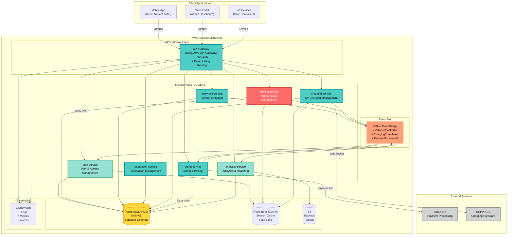
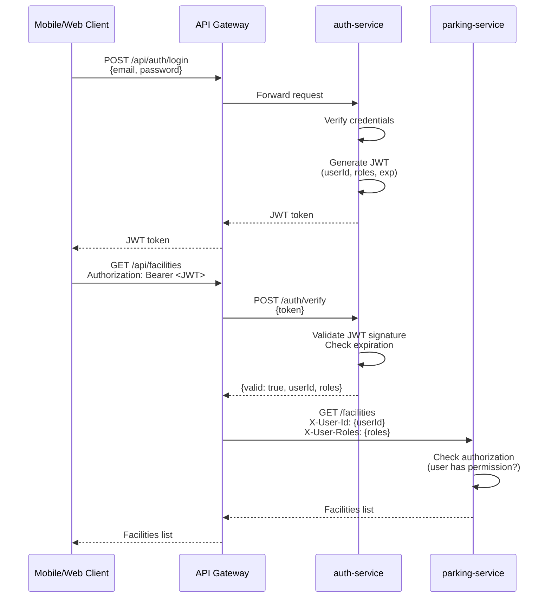

# EasyParkPlus: Microservices Architecture (Draft for Hesham)

**Architect**: Mihai (DDD Lead)  
**Microservices Lead**: Hesham  
**Date**: October 23, 2025  
**Status**: Draft - For Hesham to refine and iterate

---

## Purpose

This document provides an **orientative microservices architecture** based on Michael's Q&A sessions (all 25 questions). It shows the initial service boundaries, communication patterns, databases, and infrastructure components for the MVP.

**Hesham**: Use this as a starting point. Feel free to adjust service boundaries, add missing components, or propose alternative patterns based on your experience.

---

## Key Architectural Decisions from Michael

| Decision Area | Michael's Answer | Implication |
|---------------|------------------|-------------|
| **Database Strategy** | Single PostgreSQL with separate schemas per service (Q16) | Simpler MVP, can split later |
| **Communication** | Hybrid: REST for real-time, Kafka for async events (Q17) | Balance responsiveness with decoupling |
| **Authentication** | API Gateway with centralized JWT (Q18) | Single auth point, services trust gateway |
| **Traffic** | 50-100 req/sec peak, <300ms latency (Q19) | Moderate load, standard infra sufficient |
| **Monitoring** | AWS CloudWatch for MVP, ELK/Jaeger Phase 2 (Q20) | Simple setup first |
| **Payment Gateway** | Stripe (Q21) | Easy integration, good API |
| **DR Requirements** | RTO 1 hour, RPO 15 minutes (Q24) | Multi-AZ, 15-min backups |
| **Cross-Facility** | Real-time subscription sync, consolidated reporting (Q25) | Central subscription store |

---

## High-Level Architecture Diagram



---

## Service Details

### 1. auth-service (User & Access Management)

**Bounded Context**: BC6 - User & Access Management  
**Responsibilities**:
- User registration and authentication
- JWT token issuance and validation
- Role-based access control (RBAC)
- Subscription management (cross-facility)
- Vehicle management (user's registered vehicles)

**API Endpoints**:
- `POST /auth/register` - User registration
- `POST /auth/login` - Login and JWT issuance
- `POST /auth/verify` - Token verification (used by API Gateway)
- `GET /users/{userId}/subscriptions` - Get user subscriptions
- `POST /users/{userId}/vehicles` - Add vehicle to account

**Database Schema**: `auth_schema`  
**Tables**: `users`, `roles`, `subscriptions`, `vehicles`, `user_roles`

**Events Published**:
- `UserRegistered`
- `SubscriptionActivated`
- `SubscriptionExpired`
- `VehicleAdded`

**Technology Stack**:
- Python 3.11 + FastAPI
- JWT library (PyJWT)
- Bcrypt for password hashing
- Redis for session caching

---

### 2. parking-service (Parking Space Management)

**Bounded Context**: BC1 - Parking Space Management  
**Responsibilities**:
- Manage parking facilities (2 at MVP: Boston, Philadelphia)
- Manage parking spaces (regular, EV, accessible)
- Real-time space availability tracking
- IoT sensor integration for occupancy detection
- Space allocation and reservation

**API Endpoints**:
- `GET /facilities` - List all facilities
- `GET /facilities/{facilityId}/spaces` - Get spaces at facility
- `GET /facilities/{facilityId}/availability?type=EV` - Check availability
- `POST /spaces/{spaceId}/occupy` - Mark space occupied
- `POST /spaces/{spaceId}/vacate` - Mark space vacant

**Database Schema**: `parking_schema`  
**Tables**: `facilities`, `parking_spaces`, `space_sensors`, `occupancy_events`

**Events Published**:
- `SpaceOccupied`
- `SpaceVacated`
- `FacilityCapacityChanged`

**Events Consumed**:
- `VehicleCheckedIn` (from entry-exit-service)
- `VehicleCheckedOut` (from entry-exit-service)

**Technology Stack**:
- Python 3.11 + FastAPI
- Redis for real-time availability cache
- IoT sensor integration (MQTT or HTTP polling)

---

### 3. entry-exit-service (Vehicle Entry/Exit Management)

**Bounded Context**: BC2 - Vehicle Entry/Exit Management  
**Responsibilities**:
- Vehicle check-in at facility entry
- Vehicle check-out at facility exit
- Parking session tracking
- Session duration calculation
- Gate controller integration

**API Endpoints**:
- `POST /entry/checkin` - Vehicle check-in
- `POST /exit/checkout` - Vehicle check-out
- `GET /sessions/{sessionId}` - Get session details
- `GET /sessions/active?facilityId={id}` - List active sessions

**Database Schema**: `entry_exit_schema`  
**Tables**: `parking_sessions`, `vehicles`, `session_events`

**Events Published**:
- `VehicleCheckedIn` (triggers space allocation, billing setup)
- `VehicleCheckedOut` (triggers billing, space release)

**Events Consumed**:
- `SpaceAllocated` (from parking-service)
- `ChargingCompleted` (from charging-service - allows checkout for EVs)

**Technology Stack**:
- Python 3.11 + FastAPI
- Integration with gate controllers (REST API or MQTT)

---

### 4. reservation-service (Reservation Management)

**Bounded Context**: BC3 - Reservation Management  
**Responsibilities**:
- Reservation creation and confirmation
- Space allocation for reservations
- Cancellation and refund handling
- Grace period enforcement (15 minutes)
- Reservation expiration

**API Endpoints**:
- `POST /reservations` - Create reservation
- `GET /reservations/{reservationId}` - Get reservation details
- `DELETE /reservations/{reservationId}` - Cancel reservation
- `POST /reservations/{reservationId}/confirm` - Confirm arrival

**Database Schema**: `reservation_schema`  
**Tables**: `reservations`, `time_slots`, `cancellation_policies`

**Events Published**:
- `ReservationConfirmed`
- `ReservationCancelled`
- `ReservationExpired`

**Events Consumed**:
- `SpaceAvailabilityChanged` (from parking-service)
- `VehicleCheckedIn` (to mark reservation fulfilled)

**Technology Stack**:
- Python 3.11 + FastAPI
- Background job for expiration checks (Celery or APScheduler)

---

### 5. charging-service (EV Charging Station Management)

**Bounded Context**: BC4 - EV Charging Station Management  
**Responsibilities**:
- Manage charging stations (OCPP 2.0.1 compliant)
- Start/stop charging sessions
- Energy metering (kWh tracking)
- Load balancing (max 400 kW per facility)
- Peak shaving and demand response
- Idle time tracking

**API Endpoints**:
- `GET /facilities/{facilityId}/chargers` - List chargers at facility
- `POST /chargers/{chargerId}/start` - Start charging session
- `POST /chargers/{chargerId}/stop` - Stop charging session
- `GET /sessions/{sessionId}/status` - Get charging session status

**Database Schema**: `charging_schema`  
**Tables**: `charging_stations`, `charging_sessions`, `energy_readings`, `load_balancing_rules`

**Events Published**:
- `ChargingStarted`
- `ChargingCompleted` (triggers billing calculation)
- `EnergyMeterUpdated`
- `ChargingStationFaulted`

**Events Consumed**:
- `VehicleCheckedIn` (EV type - triggers charging initiation)
- `PaymentAuthorized` (from billing-service - allows charging to start)

**Technology Stack**:
- Python 3.11 + FastAPI
- OCPP 2.0.1 library (Python OCPP)
- WebSocket server for OCPP communication
- Background job for load balancing algorithm

**OCPP Integration**:
- Inbound messages: `StatusNotification`, `MeterValues`, `Heartbeat`
- Outbound commands: `RemoteStartTransaction`, `RemoteStopTransaction`, `GetConfiguration`

---

### 6. billing-service (Billing & Pricing Management)

**Bounded Context**: BC5 - Billing & Pricing Management  
**Responsibilities**:
- Invoice generation for parking and charging
- Static pricing (MVP - no dynamic pricing)
- Payment processing via Stripe
- Idle fee calculation (charging)
- Subscription billing (monthly passes)
- Receipt generation

**API Endpoints**:
- `POST /invoices` - Create invoice
- `GET /invoices/{invoiceId}` - Get invoice details
- `POST /payments/process` - Process payment
- `GET /pricing?facilityId={id}&spaceType={type}` - Get pricing info

**Database Schema**: `billing_schema`  
**Tables**: `invoices`, `line_items`, `pricing_policies`, `payments`, `receipts`

**Events Published**:
- `InvoiceCreated`
- `PaymentProcessed`
- `PaymentFailed`
- `ReceiptGenerated`

**Events Consumed**:
- `VehicleCheckedOut` (triggers parking invoice)
- `ChargingCompleted` (triggers charging invoice)
- `ReservationCancelled` (triggers refund processing)

**Technology Stack**:
- Python 3.11 + FastAPI
- Stripe Python SDK
- Email service for receipts (SendGrid or AWS SES)

**Pricing Rules (MVP - Static)**:
- Parking: $3/hour (first 3 hours), $5/hour after, $30/day cap
- EV Parking: $4/hour, $35/day cap
- Charging: $0.35/kWh + $2 session fee + $0.50/min idle fee
- Monthly Passes: $200-250 depending on location

---

### 7. analytics-service (Analytics & Reporting)

**Bounded Context**: BC8 - Analytics & Reporting  
**Responsibilities**:
- Occupancy metrics (target: 70% average)
- Charger utilization metrics (target: 50%)
- Revenue reporting (consolidated across facilities)
- Operational dashboards
- Data export (CSV for QuickBooks)
- Historical trend analysis

**API Endpoints**:
- `GET /analytics/occupancy?facilityId={id}&period={day|week|month}` - Occupancy metrics
- `GET /analytics/charger-utilization?facilityId={id}` - Charger metrics
- `GET /analytics/revenue?facilityId={id}&startDate={}&endDate={}` - Revenue report
- `GET /analytics/export?format=csv` - Export data

**Database Schema**: `analytics_schema` (OLAP-optimized)  
**Tables**: `occupancy_metrics`, `charger_metrics`, `revenue_metrics`, `daily_aggregates`

**Events Consumed** (via Anti-Corruption Layer):
- `SpaceOccupied`, `SpaceVacated` (from parking-service)
- `VehicleCheckedIn`, `VehicleCheckedOut` (from entry-exit-service)
- `ChargingStarted`, `ChargingCompleted` (from charging-service)
- `PaymentProcessed` (from billing-service)

**Technology Stack**:
- Python 3.11 + FastAPI
- TimescaleDB extension for PostgreSQL (time-series optimization)
- Apache Superset or Grafana for dashboards
- S3 for report storage

**ACL Pattern**:
- Analytics subscribes to all domain events
- Transforms domain-specific models to analytics-friendly format
- Read-only access to operational data

---

## Communication Patterns

### Synchronous (REST/HTTP)

| Source Service | Target Service | Use Case | Latency SLA |
|----------------|----------------|----------|-------------|
| API Gateway | auth-service | JWT verification | <50ms |
| entry-exit-service | parking-service | Check space availability | <100ms |
| reservation-service | parking-service | Reserve space | <200ms |
| billing-service | Stripe API | Process payment | <500ms |
| All services | auth-service | Validate user permissions | <100ms |

**Pattern**: Request-response for real-time operations where user is waiting.

---

### Asynchronous (Kafka/EventBridge)

| Event | Producer | Consumers | Purpose |
|-------|----------|-----------|---------|
| `VehicleCheckedIn` | entry-exit-service | parking-service, billing-service, analytics-service | Trigger space allocation, billing setup, metrics |
| `VehicleCheckedOut` | entry-exit-service | parking-service, billing-service, analytics-service | Release space, generate invoice, update metrics |
| `ChargingStarted` | charging-service | billing-service, analytics-service | Start billing timer, track session |
| `ChargingCompleted` | charging-service | entry-exit-service, billing-service, analytics-service | Allow checkout, calculate fees, update metrics |
| `PaymentProcessed` | billing-service | auth-service, analytics-service | Update subscription status, revenue tracking |
| `ReservationConfirmed` | reservation-service | parking-service, auth-service | Block space, notify user |
| `SpaceOccupied` | parking-service | analytics-service | Occupancy metrics |

**Pattern**: Event-driven for decoupled workflows where immediate response not required.

**Event Schema Example**:
```json
{
  "eventId": "uuid",
  "eventType": "VehicleCheckedIn",
  "timestamp": "2026-03-15T08:30:00Z",
  "facilityId": "facility-uuid",
  "sessionId": "session-uuid",
  "vehicleId": "vehicle-uuid",
  "userId": "user-uuid",
  "spaceType": "EV"
}
```

---

## Database Strategy (MVP)

**Technology**: PostgreSQL (AWS RDS Multi-AZ)  
**Approach**: Single instance, separate schemas per service

### Schema Isolation

```sql
-- Each service has its own schema
CREATE SCHEMA auth_schema;
CREATE SCHEMA parking_schema;
CREATE SCHEMA entry_exit_schema;
CREATE SCHEMA reservation_schema;
CREATE SCHEMA charging_schema;
CREATE SCHEMA billing_schema;
CREATE SCHEMA analytics_schema;

-- Example: parking_schema tables
CREATE TABLE parking_schema.facilities (
    facility_id UUID PRIMARY KEY,
    name VARCHAR(255),
    location GEOGRAPHY(POINT),
    capacity INTEGER,
    created_at TIMESTAMP
);

CREATE TABLE parking_schema.parking_spaces (
    space_id UUID PRIMARY KEY,
    facility_id UUID REFERENCES parking_schema.facilities(facility_id),
    space_number VARCHAR(50),
    space_type VARCHAR(20), -- 'regular', 'ev', 'accessible'
    status VARCHAR(20), -- 'available', 'occupied', 'reserved', 'maintenance'
    created_at TIMESTAMP
);
```

**Benefits**:
- Simpler operations (single backup, single connection pool)
- Cross-schema queries possible if needed (anti-pattern but useful for debugging)
- Easier to split into separate databases later (schema export/import)

**Migration Path to Separate Databases (Phase 2)**:
1. Export schema to new RDS instance
2. Update service configuration (connection string)
3. Remove cross-schema queries (if any)
4. Decommission old schema

---

## Security & Authentication Flow

### JWT Authentication Flow



**Key Points**:
- API Gateway validates JWT before routing (centralized auth per Michael Q18)
- Services receive pre-validated user context in headers (no auth logic in services)
- JWT contains: `userId`, `roles`, `exp`, `iat`, `facilityAccess` (if applicable)
- Redis cache for token blacklist (logout, password reset)

---

## Monitoring & Observability (MVP)

**Tool**: AWS CloudWatch (per Michael Q20)

### Metrics to Track

| Service | Key Metrics |
|---------|-------------|
| **API Gateway** | Request count, 4xx/5xx errors, latency (p50, p95, p99) |
| **auth-service** | Login success/failure rate, JWT generation time, cache hit rate |
| **parking-service** | Space availability query latency, occupancy rate |
| **entry-exit-service** | Check-in/check-out latency, session duration average |
| **charging-service** | Active charging sessions, energy delivered (kWh), OCPP message latency |
| **billing-service** | Payment success/failure rate, invoice generation time, Stripe API latency |
| **analytics-service** | Report generation time, query latency |

### Alarms

- API Gateway 5xx errors > 5% for 5 minutes
- Any service latency p95 > 500ms
- Billing payment failure rate > 10%
- Charging station offline > 15 minutes
- Database connection pool exhaustion
- Kafka consumer lag > 1000 messages

### Log Structure (JSON)

```json
{
  "timestamp": "2026-03-15T08:30:00Z",
  "level": "INFO",
  "service": "parking-service",
  "traceId": "correlation-uuid",
  "userId": "user-uuid",
  "facilityId": "facility-uuid",
  "message": "Space allocated",
  "spaceId": "space-uuid",
  "duration_ms": 45
}
```

**Correlation ID**: Generated at API Gateway, propagated through all services for request tracing.

---

## Disaster Recovery (RTO 1 hour, RPO 15 minutes)

**Requirements from Michael Q24**:
- **RTO**: 1 hour (time to restore service)
- **RPO**: 15 minutes (acceptable data loss)

### Implementation

**Database Backups**:
- Automated RDS backups every 15 minutes (point-in-time recovery)
- Multi-AZ deployment for automatic failover (<2 minutes)
- Cross-region backup replication (daily snapshot to DR region)

**Application Deployment**:
- Infrastructure as Code (Terraform or CloudFormation)
- Blue-green deployment for zero-downtime updates
- Auto-scaling groups for ECS tasks (min 2 instances per service)

**Recovery Procedure**:
1. Detect failure via CloudWatch alarms (< 5 minutes)
2. Multi-AZ automatic failover (< 2 minutes)
3. If full region failure: Deploy to DR region from IaC (< 30 minutes)
4. Restore database from latest backup (< 15 minutes)
5. Validate service health checks (< 10 minutes)
6. Total: ~60 minutes RTO achieved

---

## Deployment Architecture

**Container Orchestration**: AWS ECS (Fargate) or EKS  
**CI/CD**: GitHub Actions or AWS CodePipeline  
**Deployment Strategy**: Blue-Green with health checks

### ECS Task Definitions (Example)

```yaml
service: parking-service
  cpu: 512
  memory: 1024
  replicas: 2
  healthCheck:
    path: /health
    interval: 30s
    timeout: 5s
  environment:
    - DATABASE_URL: ${POSTGRES_CONNECTION_STRING}
    - REDIS_URL: ${REDIS_CONNECTION_STRING}
    - KAFKA_BROKERS: ${KAFKA_BROKERS}
    - LOG_LEVEL: INFO
  secrets:
    - DATABASE_PASSWORD: /easypark/prod/db_password
    - JWT_SECRET: /easypark/prod/jwt_secret
```

---

## Phase 2 Enhancements (Future)

**Not needed for MVP but plan architecture to support**:

1. **Facility Operations & Maintenance Service** (BC7)
   - Maintenance scheduling
   - Equipment health monitoring
   - Vendor SLA tracking

2. **Dynamic Pricing Engine**
   - ML model integration (after 3-6 months data - Q11)
   - Occupancy-based rate adjustments
   - Peak hour surge pricing

3. **Advanced Analytics**
   - ELK stack for log analysis (Q20)
   - Jaeger for distributed tracing (Q20)
   - ML forecasting models

4. **Third-Party Integrations**
   - QuickBooks for automated accounting (Q23)
   - Salesforce CRM for fleet management (Q23)
   - WEX fleet payment network (Q21)

5. **Multi-Region Deployment**
   - New York, Washington D.C. facilities (Q4)
   - Cross-region data replication
   - Geo-routing via Route 53

---

## Open Questions for Hesham

1. **Service Granularity**: Should charging-service be split into `charging-station-service` and `charging-session-service`? Or keep as single service?

2. **API Gateway**: Prefer AWS API Gateway (managed) or self-hosted Kong/Tyk (more control)?

3. **Event Bus**: AWS EventBridge (simpler) or self-managed Kafka on EKS (more scalable)?

4. **Container Platform**: ECS Fargate (less operational overhead) or EKS (more flexibility)?

5. **Database**: Stick with vanilla PostgreSQL or add TimescaleDB extension for analytics time-series data?

6. **OCPP Implementation**: Use existing Python OCPP library or custom implementation?

7. **Load Balancing Algorithm**: Round-robin power allocation or priority-based (e.g., nearly-full batteries get less power)?

---

## Next Steps

1. **Hesham**: Review this architecture and propose refinements
2. **Team**: Agree on technology stack for each service
3. **Hesham**: Create detailed service API specifications (OpenAPI/Swagger)
4. **Team**: Set up AWS infrastructure (VPC, RDS, ECS clusters)
5. **Mihai**: Finalize domain models for each bounded context
6. **Team**: Begin parallel development of services

---

**Status**: Draft architecture ready for Hesham's review and refinement  
**Last Updated**: October 23, 2025
